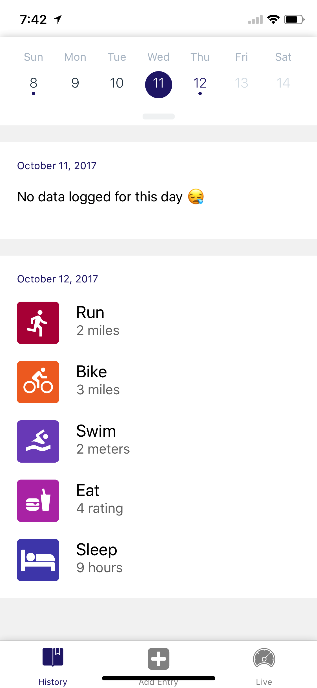

<br />

<h1 align="center">React Native Fitness</h1>
<div align="center"> A Fitness app used to tracke activities as well as speed, direction and altitude </div>

<br />
<br />

<div align="center">
    
</div>


## Getting Started

```sh
git clone https://github.com/romarioraffington/react-native-fitness

cd react-native-fitness/
yarn install
yarn start
```

## License

[MIT](LICENSE.md)